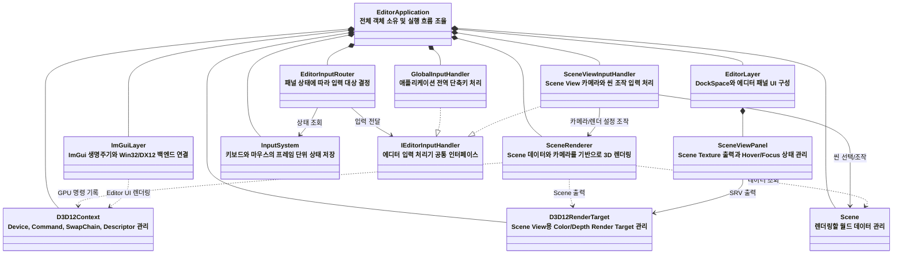

# D12Engine

DirectX 12 기반의 실시간 3D 렌더러와 ImGui 에디터를 구현하는 개인 프로젝트입니다.

*Introduction to 3D Game Programming with DirectX 12*에서 학습한 렌더링 기법을 바탕으로, 단일 예제 애플리케이션 구조를 `Editor`, `Renderer`, `EngineCore` 계층으로 분리하고 재사용 가능한 렌더링 엔진 구조로 확장하고 있습니다.

```text
단일 RenderApp
        ↓
EditorApplication
├─ Editor
├─ EngineCore
└─ Renderer
```
---


---

## 주요 목표

- DirectX 12 렌더링 파이프라인의 직접 구현과 이해
- 렌더러, 에디터 계층의 책임 분리
- ImGui Docking 기반 Scene Editor 구현
- Descriptor, Frame Resource, GPU 동기화 구조 일반화
- 렌더링 기능별 성능 측정 및 시각적 비교
- 향후 외부 모델과 애니메이션을 불러올 수 있는 런타임 렌더러 구축

---

## 사용 라이브러리

- [Dear ImGui](https://github.com/ocornut/imgui)  
  Docking 기반 에디터 UI 구현

- [ufbx](https://github.com/ufbx/ufbx)  
  FBX 메시, 스켈레톤, 애니메이션, 머티리얼 및 텍스처 데이터 임포트

- [DirectX-Headers](https://github.com/microsoft/DirectX-Headers)  
  DirectX 12 헤더와 `d3dx12.h` 헬퍼 사용
  
---
