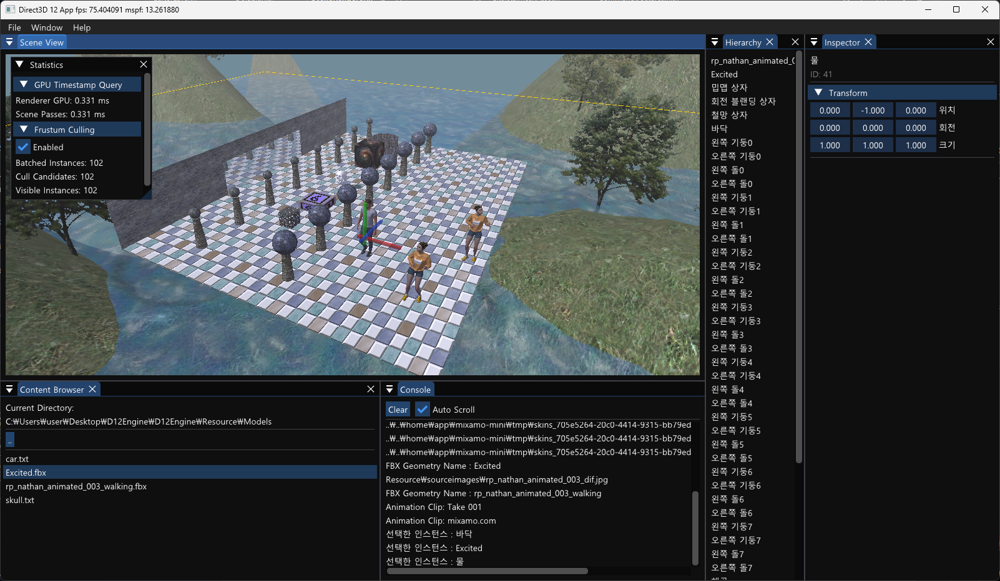
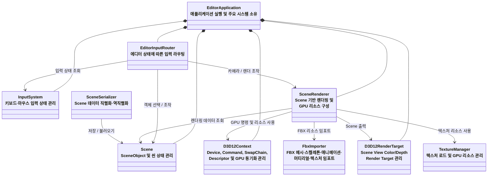

# D12Engine



DirectX 12 기반의 실시간 3D 렌더러와 ImGui 에디터를 구현한 개인 프로젝트입니다.

*Introduction to 3D Game Programming with DirectX 12*에서 학습한 렌더링 기법을 바탕으로, 단일 예제 애플리케이션을 `Editor`, `Renderer`, `EngineCore` 계층으로 분리하고 재사용 가능한 렌더링 엔진 구조로 확장했습니다. 외부 FBX 모델의 메시, 스켈레톤, 애니메이션, 머티리얼 및 텍스처 임포트와 씬 직렬화까지 구현했으며, 현재는 기반 구조의 확장을 마무리하고 렌더링 고급 기능과 에디터 편의성·사용성 고도화에 집중하고 있습니다.

## 프로젝트 구조

```text
단일 RenderApp
        ↓
EditorApplication
├─ Editor
├─ EngineCore
└─ Renderer
```



---

## 의존성 설치

이 프로젝트는 [vcpkg](https://github.com/microsoft/vcpkg)의 Manifest 모드를 사용하여 Protocol Buffers 등의 외부 라이브러리와 전이 종속성을 관리합니다.  
저장소의 `vcpkg.json`에 선언된 라이브러리는 첫 빌드 시 프로젝트의 `vcpkg_installed` 폴더에 자동으로 설치됩니다.

다른 컴퓨터에서 처음 빌드하는 경우, 명령 프롬프트에서 vcpkg를 설치하고 Visual Studio의 MSBuild와 연결합니다.

```bat
git clone https://github.com/microsoft/vcpkg.git C:\vcpkg
C:\vcpkg\bootstrap-vcpkg.bat
C:\vcpkg\vcpkg.exe integrate install
```

> `C:\vcpkg`가 아닌 다른 위치에 설치한 경우 이후 명령의 경로도 해당 위치에 맞게 변경해야 합니다.

설치 후 Visual Studio를 다시 실행하고 솔루션을 빌드합니다.

---

## 사용 라이브러리

- [Dear ImGui](https://github.com/ocornut/imgui)  
  Docking 기반 에디터 UI 구현

- [ufbx](https://github.com/ufbx/ufbx)  
  FBX 메시, 스켈레톤, 애니메이션, 머티리얼 및 텍스처 데이터 임포트

- [DirectXTex](https://github.com/microsoft/DirectXTex)  
  DDS, WIC 등의 텍스처 파일 로드와 이미지 데이터 처리를 위해 사용하며, 이를 기반으로 텍스처 리소스의 생성·조회·수명을 관리하는 `TextureManager`를 구현

- [DirectX-Headers](https://github.com/microsoft/DirectX-Headers)  
  DirectX 12 헤더와 `d3dx12.h` 헬퍼 사용

- [Protocol Buffers](https://github.com/protocolbuffers/protobuf)  
  씬 및 엔진 데이터 직렬화를 위한 데이터 스키마와 바이너리 포맷 구현
